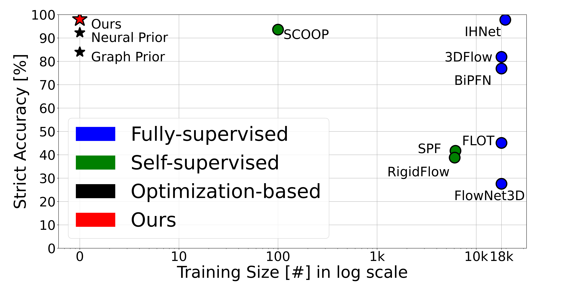
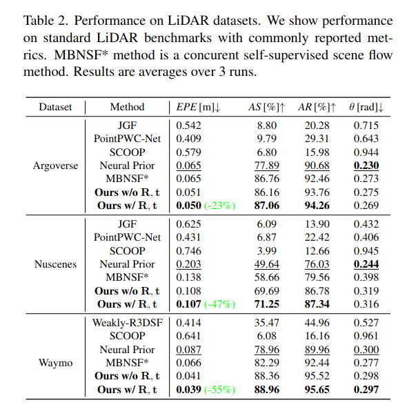
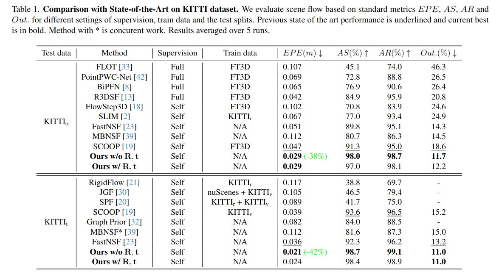
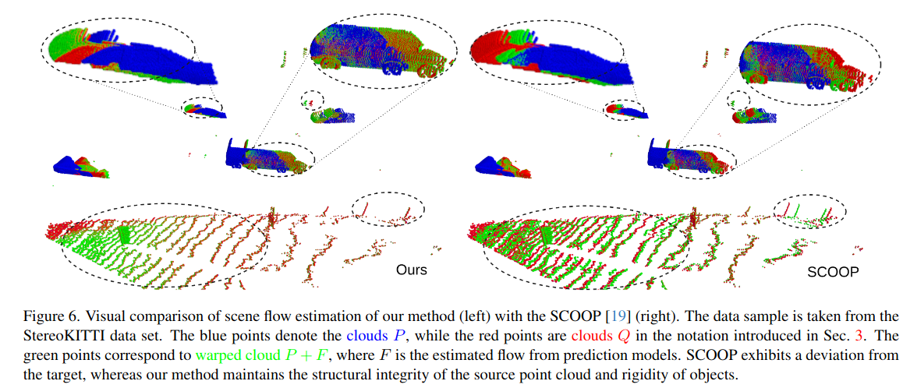

# Soft Rigidity Scene Flow Regularization


<!-- # Current Results on Waymo Dataset with against [FastFlow](https://github.com/Lilac-Lee/FastNSF/tree/main) -->
<!--  -->

# Results on StereoKITTI dataset 



# Installation
- Install [Fast Geodis](https://github.com/masadcv/FastGeodis) with pip install FastGeodis --no-build-isolation
- Install [PyTorch3d](https://github.com/facebookresearch/pytorch3d) with CUDA support.
- Install [PyTorch Scatter](https://github.com/rusty1s/pytorch_scatter/tree/master) with CUDA support.
- Run commands in **install.sh** for installation of the packages above

# DATA
- Setup directory for extracting the data, visuals and experimental results
```console
BASE_PATH='path_where_to_store_data'
```
- Download [Data](https://login.rci.cvut.cz/data/lidar_intensity/sceneflow/data_sceneflow.tgz) and unpack it to the folder **$BASE_PATH/data/sceneflow**:

```console
tar -xvf data_sceneflow.tgz $BASE_PATH/data/sceneflow
```

# Run Experiments
To run the method on all datasets with final metrics printed, just type:
```console
for i in {0..4}; do python evaluate_flow.py $i; done
```
where the argument sets the specific datasets according to the following table:
| Dataset       | Argument Number |
|--------------|-----------|
| KITTI t | 0 |
| StereoKITTI | 1 |
| Argoverse | 2 |
| Nuscenes | 3 |
| Waymo | 4 |

# Experimental results

<!--  -->

<p align="center">
  
</p>


<p align="center">
  
</p>

# Qualitative Example
